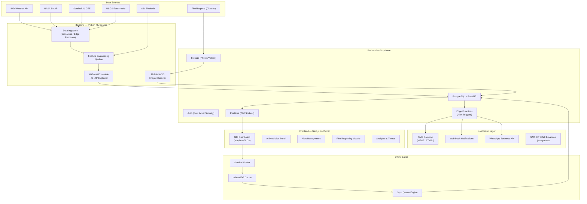
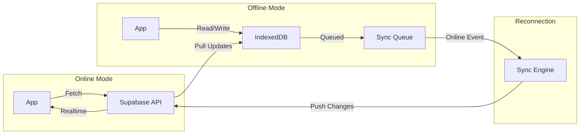

# 🏔️ LandslideGuard AI — SIH 2026 Implementation Plan

> **AI-Based Early Warning & Landslide Risk Monitoring System for North Eastern Region**  
> Department: MDoNER | Category: Software | Theme: Disaster Management

---

## 🔍 Competitive Analysis — Existing Solutions & Our Edge

### What Already Exists

| System | Owner | Strengths | Critical Gaps (Our Opportunity) |
|:---|:---|:---|:---|
| **Bhusanket Portal** | GSI (Geological Survey of India) | Official landslide forecasts, color-coded warnings | ❌ No citizen reporting, ❌ no AI/ML models, ❌ no real-time GIS heatmaps, ❌ no offline support |
| **Bhooskhalan App** | GSI | Mobile access, hazard insights | ❌ Information-only (no prediction), ❌ no field official reporting, ❌ limited to alerts |
| **NLFC (National Landslide Forecasting Centre)** | GSI Kolkata | Covers 21 districts across 8 states, multi-agency integration | ❌ Only 21/128 NER districts covered, ❌ not AI-driven, ❌ no community participation |
| **IIT Mandi LEWS** | IIT Mandi | ML-based, WhatsApp alerts, IoT sensors | ❌ Focused on Himachal Pradesh only, ❌ not NER-specific, ❌ no GIS dashboards |
| **Amrita A-LEWS** | Amrita University | Multi-level sensor network in Munnar | ❌ Hardware-heavy (expensive), ❌ only Kerala, ❌ no scalable software platform |
| **NASA LHASA v2.1** | NASA | Open-source, XGBoost, global coverage | ❌ 1km resolution (too coarse for NER terrain), ❌ no India-specific tuning, ❌ no local alert system |
| **SACHET (NDMA)** | C-DOT / NDMA | Cell broadcast, 19+ languages | ❌ Alert dissemination only — no prediction, ❌ no analytics dashboard |

### Our Winning Differentiators

> [!IMPORTANT]
> **No existing solution combines ALL of these**: AI prediction + real-time GIS + citizen reporting + offline-first + NER-specific tuning + multilingual alerts + explainable AI. This is our USP.

1. **NER-Specific AI Engine** — Trained exclusively on NER geological, seismic, and rainfall data (not generic global models)
2. **Explainable AI (XAI) with SHAP** — Judges love this: shows *why* a region is high-risk, not just a score
3. **Bidirectional Citizen Engagement** — Field officials upload geo-tagged evidence; system sends multilingual alerts back
4. **Offline-First Architecture** — PWA with IndexedDB sync queue + service workers for NER's remote areas
5. **Real-time GIS with 3D Terrain** — Mapbox GL JS with DEM overlays, not flat 2D maps
6. **Road Connectivity Graph** — Shows which roads/villages get cut off when a landslide occurs (no other system does this)

---

## 📊 Data Sources & Integration Architecture

### Layer 1: Static Geospatial Data (Pre-loaded)

| Data Type | Source | Format | Resolution | Usage |
|:---|:---|:---|:---|:---|
| **Elevation / DEM** | SRTM via OpenTopography API / ISRO CartoDEM via Bhuvan | GeoTIFF | 30m | Slope, aspect, curvature calculation |
| **Historical Landslides** | GSI Bhukosh + ISRO Bhuvan Landslide Atlas + NESAC NeSDR | GeoJSON/Shapefile | Point data (~80K events) | Training labels for ML model |
| **Lithology/Geology** | GSI Bhukosh | Vector layers | 1:50K scale | Rock type susceptibility |
| **Road Network** | OpenStreetMap (Overpass API) | GeoJSON | High | Connectivity analysis |
| **Village/Settlement** | Census 2021 + OSM | GeoJSON | Point/Polygon | Impact assessment & alerts |
| **Land Use / Land Cover** | ISRO Bhuvan / ESA WorldCover | Raster | 10m | Vegetation cover, bare soil detection |
| **Fault Lines / Lineaments** | GSI geological maps | Vector | Regional | Seismic susceptibility factor |

### Layer 2: Dynamic Real-Time Data (API Integration)

| Data Type | Source | API/Access | Update Frequency | Usage |
|:---|:---|:---|:---|:---|
| **Rainfall (District-wise)** | IMD API (`api.imd.gov.in`) | REST API (official) | Hourly / 3-hourly | Primary trigger variable |
| **Rainfall Forecast (QPF)** | IMD River Basin QPF API | REST API | 24h / 48h / 72h forecast | Predictive trigger |
| **Soil Moisture** | NASA SMAP (via Earthdata / GEE) | REST / GEE Python API | 6-hourly (NRT) | Saturation indicator |
| **Satellite Imagery (NDVI)** | Sentinel-2 via Copernicus Data Space | OData + Process API | 5-day revisit | Vegetation loss / post-event mapping |
| **Seismic Activity** | USGS Earthquake API / IMD Seismology | REST API | Real-time | Earthquake-triggered landslide risk |
| **Weather (Temperature, Wind)** | OpenWeatherMap API (free tier) | REST API | Every 15 min | Supplementary weather context |

### Layer 3: Crowdsourced / Field Data

| Data Type | Source | Method | Usage |
|:---|:---|:---|:---|
| **Geo-tagged Photos/Videos** | Citizens / Field Officials | Mobile PWA upload → Supabase Storage | Visual verification + AI image classification |
| **Incident Reports** | Officials via app | Structured form → Supabase DB | Ground-truth for model validation |
| **Road Blockage Reports** | Citizens / BRO | App + manual entry | Real-time connectivity updates |

---

## 🧠 AI/ML Engine Architecture

### Model 1: Landslide Susceptibility Mapping (Static — runs once, updated quarterly)

```
Purpose: Generate a baseline risk map for all NER districts
Algorithm: XGBoost (primary) + Random Forest (ensemble)
```

**Input Features (12 static features):**
| # | Feature | Source | Why It Matters |
|:---|:---|:---|:---|
| 1 | Slope (degrees) | SRTM DEM | Most critical factor — steeper slopes = higher risk |
| 2 | Aspect | SRTM DEM | Sun-facing vs. shade — affects soil moisture |
| 3 | Curvature | SRTM DEM | Concave surfaces collect water → more slides |
| 4 | Elevation | SRTM DEM | Higher elevations → thinner soil, more exposure |
| 5 | Lithology class | GSI | Certain rock types are more prone to failure |
| 6 | Distance to faults | GSI | Proximity to fault lines increases instability |
| 7 | Distance to roads | OSM | Road cuts destabilize slopes |
| 8 | Distance to rivers | OSM / HydroSHEDS | Riverbank erosion undermines slopes |
| 9 | NDVI | Sentinel-2 | Low vegetation = bare, unstable slopes |
| 10 | Land Use / Land Cover | ESA WorldCover | Deforested / urban areas more vulnerable |
| 11 | Drainage density | DEM-derived | High density = more water flow on slopes |
| 12 | TWI (Topographic Wetness Index) | DEM-derived | Predicts water accumulation zones |

**Training Labels:** ~80,000 landslide points from ISRO Landslide Atlas + GSI Bhukosh (1998–2024)

**Output:** Susceptibility score (0–1) for every 30m×30m pixel → classified into 5 levels:
- 🟢 Very Low (0–0.2) | 🟡 Low (0.2–0.4) | 🟠 Medium (0.4–0.6) | 🔴 High (0.6–0.8) | ⚫ Very High (0.8–1.0)

---

### Model 2: Dynamic Risk Prediction ("Nowcast" — runs every 6 hours)

```
Purpose: Predict landslide probability in next 24–48 hours
Algorithm: XGBoost with temporal features
Inspired by: NASA LHASA v2.1 (but NER-tuned)
```

**Input Features (Static + Dynamic):**
| # | Feature | Type | Source |
|:---|:---|:---|:---|
| 1–12 | All static features above | Static | Pre-computed |
| 13 | Current rainfall (24h) | Dynamic | IMD API |
| 14 | Antecedent Rainfall Index (7-day weighted) | Dynamic | IMD API (computed) |
| 15 | Rainfall forecast (48h) | Dynamic | IMD QPF API |
| 16 | Soil moisture (current) | Dynamic | NASA SMAP NRT |
| 17 | Soil moisture anomaly (vs. monthly avg) | Dynamic | SMAP historical |
| 18 | Recent seismic activity (7-day, nearest event magnitude) | Dynamic | USGS/IMD Seismo |

**Output:** Risk probability (0–100%) + SHAP explanation per district/sub-district

**Alert Thresholds:**
| Risk Level | Probability | Action |
|:---|:---|:---|
| 🟢 Low | 0–25% | No alert |
| 🟡 Moderate | 25–50% | Advisory to district admin |
| 🟠 High | 50–75% | Warning to SDMA + communities + SMS |
| 🔴 Very High | 75–100% | **Emergency Alert** — Evacuation advisory, all channels |

---

### Model 3: Crowd-sourced Image Classification (On-demand)

```
Purpose: Classify uploaded field photos into risk categories
Algorithm: Fine-tuned MobileNetV3 (lightweight for edge/low-bandwidth)
```

**Classes:** `crack_in_slope` | `slope_movement` | `blocked_road` | `waterlogging` | `normal` | `post_landslide`

---

### Explainability Layer (SHAP)

```python
# Example: For every prediction, generate SHAP waterfall plot
import shap
explainer = shap.TreeExplainer(xgb_model)
shap_values = explainer(X_district)
# → "78% risk because: Rainfall(85%) + Soil Moisture(72%) + Slope(66%)"
```

> [!TIP]
> **Why SHAP wins at SIH:** Judges evaluate "Innovation" and "Technical Complexity." Explainable AI demonstrates that your model isn't a black box — it tells decision-makers *exactly* why a district is at risk, which is critical for governance and trust.

---

## 🏗️ System Architecture



---

## 🖥️ Tech Stack (Detailed)

### Frontend (Web + Mobile PWA)
| Component | Technology | Rationale |
|:---|:---|:---|
| Framework | **Next.js 14+ (App Router)** | SSR for SEO, RSC for performance, API routes |
| Mapping | **Mapbox GL JS** (free tier: 50K loads/month) | WebGL, 3D terrain, heatmaps, vector tiles |
| Charts | **Recharts** or **Tremor** | Beautiful, React-native charting |
| UI Library | **shadcn/ui + Radix** | Accessible, customizable, premium feel |
| State Mgmt | **TanStack Query + Zustand** | Server state caching + local state |
| Offline | **Service Worker + IndexedDB (idb)** | PWA offline-first capability |
| i18n | **next-intl** | Multilingual: English, Hindi, Assamese, Bengali, Manipuri, Mizo, Nagamese, Khasi |

### Backend
| Component | Technology | Rationale |
|:---|:---|:---|
| Database | **Supabase PostgreSQL + PostGIS** | Spatial queries, real-time subscriptions |
| Auth | **Supabase Auth (RLS)** | Role-based: Admin, District Official, Citizen |
| Storage | **Supabase Storage** | Geo-tagged photo/video uploads |
| Realtime | **Supabase Realtime** | Live dashboard updates via WebSocket |
| Edge Logic | **Supabase Edge Functions (Deno)** | Alert triggers, API proxies, webhook handlers |
| Hosting | **Vercel** | Auto-scaling, edge network, Next.js native |

### ML/AI Service
| Component | Technology | Rationale |
|:---|:---|:---|
| ML Framework | **scikit-learn + XGBoost + SHAP** | Best-in-class for tabular geo data |
| Image Model | **PyTorch + MobileNetV3** | Lightweight CNN for field photo classification |
| Data Processing | **pandas + numpy + rasterio + geopandas** | Geospatial data wrangling |
| API Server | **FastAPI** | High-performance Python REST API for model serving |
| Deployment | **Railway / Render / Vercel Python Functions** | Cost-effective ML serving |
| Scheduling | **APScheduler / Cron** | 6-hourly nowcast generation |
| GEE Integration | **earthengine-api (Python)** | Satellite data processing |

---

## 📱 Application Modules & Pages

### 1. 🏠 Landing Page
- Hero section with NER mountain imagery
- Key stats: districts monitored, active alerts, avg rainfall
- Feature highlights with micro-animations
- "Explore Live Map" and "Get Started" CTAs

### 2. 📊 Dashboard (Authenticated)
- **4 KPI cards**: Total Districts, High-Risk Zones, Active Alerts, Avg Rainfall
- **Interactive Risk Map** (Mapbox GL): Heatmap overlay on NER with zoom-to-district
- **Recent Alerts sidebar**: Color-coded alert cards with timestamps
- **Quick filters**: By state, risk level, time range

### 3. 🗺️ Live Map
- Full-screen Mapbox with layer toggles:
  - `Risk Heatmap` — susceptibility overlay
  - `Rainfall` — real-time precipitation
  - `Landslide Inventory` — historical events
  - `Terrain / 3D` — slope visualization
  - `Road Network` — connectivity status
  - `Weather Stations` — IMD stations
- Click-on-district popup: risk score, contributing factors, trend chart
- Search by district/state/coordinates

### 4. 🤖 AI Prediction Panel
- **Input**: Select district or enter coordinates
- **Output**:
  - Risk probability gauge (0–100%)
  - SHAP waterfall chart showing top contributing factors
  - "Key Factors" bar chart (Rainfall, Soil Moisture, Slope, Elevation, NDVI)
  - Textual explanation: *"78% risk — Heavy rainfall (85th percentile) combined with saturated soil and steep terrain"*
- Historical prediction accuracy tracker

### 5. 🚨 Alerts & Notifications
- Filterable alert list (All / High / Medium / Low)
- Each alert shows: location, severity, timestamp, recommended action
- "Send Emergency Alert" button for admins → triggers SMS/Push/WhatsApp
- Alert history with resolution status

### 6. 📍 Region-wise Analysis
- State dropdown → District-level breakdown
- State map with district risk coloring
- Statistics panel: Total districts, risk distribution, top 5 high-risk districts
- Trend analysis: Monthly/seasonal risk evolution

### 7. 📸 Field Reporting
- **Upload Form**: Photo/video + GPS auto-tag + category selection + description
- Camera integration (mobile PWA)
- AI classification result displayed after upload
- Report status tracking (Submitted → Verified → Resolved)
- **Works offline** — queues reports for sync when connectivity returns

### 8. 📈 Analytics & Trends
- **Tab 1 — Rainfall Trend**: Monthly rainfall chart with monsoon overlay
- **Tab 2 — Landslide Occurrences**: Historical event frequency by year/month
- **Tab 3 — Model Performance**: Accuracy, precision, recall, F1 over time
- Key Insights cards with data-driven observations

### 9. 📚 Data & Resources
- Catalog of all data sources used with attribution
- Download options: Risk maps (GeoJSON/CSV), historical data, reports
- API documentation for third-party integration
- Research papers and methodology documentation

### 10. ⚙️ Settings (Admin)
- User management (RBAC)
- Alert threshold configuration
- Notification channel preferences
- System health monitoring

---

## 🌐 Offline-First Architecture



**Key Components:**
1. **Service Worker** — Caches static assets + recent map tiles + last known risk data
2. **IndexedDB** — Stores:
   - Last fetched risk scores for all districts
   - Pending field reports (with photos as blobs)
   - User's notification preferences
3. **Sync Queue** — On reconnection:
   - Push pending field reports to Supabase Storage + DB
   - Pull latest alerts and risk updates
   - Conflict resolution: last-write-wins with timestamp comparison

---

## 🌍 Multilingual Notification System

| Language | Code | NER States Covered |
|:---|:---|:---|
| English | `en` | All states |
| Hindi | `hi` | Tripura, Mizoram (official) |
| Assamese | `as` | Assam |
| Bengali | `bn` | Tripura, parts of Assam |
| Manipuri (Meitei) | `mni` | Manipur |
| Mizo | `lus` | Mizoram |
| Nagamese | `nag` | Nagaland |
| Khasi | `kha` | Meghalaya |

**Notification Channels:**
1. **SMS (MSG91)** — Unicode support for all NE languages, DLT compliant
2. **Web Push** — Browser notifications via service worker
3. **WhatsApp Business API** — Template messages with risk maps attached
4. **In-App** — Supabase Realtime → toast notifications on dashboard
5. **Integration Point** — CAP (Common Alerting Protocol) format for SACHET/NDMA interop

---

## 🗄️ Database Schema (Supabase PostgreSQL + PostGIS)

```sql
-- Core Tables
districts (id, name, state, geometry GEOMETRY(Polygon, 4326), population, area_sqkm)
risk_scores (id, district_id, timestamp, susceptibility_score, dynamic_risk_score, risk_level, shap_factors JSONB)
alerts (id, district_id, severity, message, message_translations JSONB, created_at, resolved_at, status)
field_reports (id, user_id, location GEOMETRY(Point, 4326), category, description, photo_urls TEXT[], ai_classification, status, created_at, synced_at)
weather_data (id, district_id, timestamp, rainfall_mm, temperature, humidity, wind_speed, source)
soil_moisture (id, district_id, timestamp, moisture_value, anomaly_value, source)

-- Auth & Roles
profiles (id, user_id, role ENUM('admin','district_official','citizen'), district_id, language_pref, notification_prefs JSONB)

-- Road Connectivity
roads (id, name, geometry GEOMETRY(LineString, 4326), type, district_id)
road_status (id, road_id, status ENUM('open','partially_blocked','fully_blocked'), reported_by, reported_at, photo_url)
```

---

## 🚀 Implementation Phases

### Phase 1: Foundation (Week 1–2)
- [ ] Set up Next.js project with shadcn/ui, Mapbox GL, next-intl
- [ ] Configure Supabase (DB schema, Auth, Storage, RLS policies)
- [ ] Build landing page with premium design
- [ ] Implement dashboard layout with KPI cards and map skeleton

### Phase 2: GIS & Data (Week 3–4)
- [ ] Integrate Mapbox GL with NER boundary GeoJSON
- [ ] Build layer toggle system (risk heatmap, rainfall, terrain, roads)
- [ ] Implement district click → detail popup
- [ ] Load static data: DEM-derived slopes, historical landslides, road network
- [ ] Set up IMD API integration for real-time rainfall

### Phase 3: ML Engine (Week 4–6)
- [ ] Build data pipeline: download and preprocess all 12 static features
- [ ] Train XGBoost susceptibility model on GSI/ISRO landslide inventory
- [ ] Implement SHAP explainability for per-prediction interpretation
- [ ] Build FastAPI server for model serving
- [ ] Create 6-hourly nowcast pipeline with dynamic features
- [ ] Train MobileNetV3 image classifier on landslide field photos

### Phase 4: Alerts & Reporting (Week 6–7)
- [ ] Build alert management system with severity-based filtering
- [ ] Integrate SMS gateway (MSG91) with multilingual templates
- [ ] Implement field reporting module with camera + GPS
- [ ] Build offline queue + sync engine with service worker
- [ ] Implement Supabase Edge Functions for alert triggers

### Phase 5: Analytics & Polish (Week 7–8)
- [ ] Build analytics dashboard with rainfall trends + occurrence charts
- [ ] Region-wise analysis with state/district drill-down
- [ ] Model performance tracking page
- [ ] PWA manifest + installability
- [ ] Performance optimization (lazy loading, code splitting, image optimization)
- [ ] Security audit (RLS, input sanitization, API rate limiting)

---

## ✅ Verification Plan

### Automated Tests
```bash
# Frontend
npm run test          # Jest + React Testing Library
npm run e2e           # Playwright E2E tests

# ML Pipeline
pytest tests/         # Model accuracy, SHAP output validation
python evaluate.py    # ROC-AUC, F1, Precision, Recall on test set
```

### Manual Verification
- [ ] Visual QA across all pages (desktop + mobile)
- [ ] Offline mode testing: disable network → create report → reconnect → verify sync
- [ ] Alert flow testing: trigger high-risk score → verify SMS + push delivery
- [ ] Map interaction testing: zoom, click, layer toggle performance
- [ ] Multilingual rendering check for all 8 languages
- [ ] Load testing: simulate 1000+ concurrent dashboard users

### Demo-Ready Validation
- [ ] Pre-load realistic NER data for all 128 districts
- [ ] Prepare 3 demo scenarios:
  1. **Mangan, Sikkim** — High risk (heavy monsoon + steep terrain)
  2. **Dima Hasao, Assam** — Active landslide zone with road blockages
  3. **East Khasi Hills, Meghalaya** — Moderate risk with citizen reports
- [ ] Record a 5-minute demo video showing full user journey

---

## 🏆 SIH Judging Criteria Alignment

| Criteria | How We Score |
|:---|:---|
| **Novelty** | Only solution combining NER-tuned XGBoost + SHAP explainability + citizen crowdsourcing + offline PWA |
| **Complexity** | Multi-source data fusion (7 APIs), ensemble ML, real-time GIS, offline-first sync |
| **Clarity** | SHAP makes predictions transparent; clean dashboard makes data actionable |
| **Feasibility** | All data sources are free/open; tech stack is proven; architecture is scalable |
| **Practicability** | Designed for actual district admin use — role-based access, vernacular alerts, offline mode |
| **Sustainability** | Cloud-based with Supabase free tier; no expensive hardware dependencies |
| **Impact** | Covers all 128 NER districts, 8 states, ~46M population; reduces response time from hours to minutes |

---

## Open Questions

> [!IMPORTANT]
> **Q1:** Do you want to build the PWA as a single Next.js app that works on both desktop and mobile, or should we also plan a separate React Native mobile app for field officials?

> [!IMPORTANT]
> **Q2:** For the ML model demo, should we train on **real NER data** (requires downloading ~2GB of geospatial files and processing time) or prepare a **synthetic dataset** that simulates realistic NER conditions for a faster prototype?

> [!IMPORTANT]
> **Q3:** Should we use **Mapbox GL JS** (more powerful, 3D terrain, but requires API key with 50K free loads/month) or **MapLibre GL JS** (fully open-source fork, no API key needed, but no 3D terrain out of box)?

> [!WARNING]
> **Q4:** The IMD official API requires institutional access (contacting a nodal officer). For the hackathon prototype, should we use the **OpenWeatherMap API** as a stand-in for rainfall data, and document the IMD integration as a "production roadmap" item?

> [!NOTE]
> **Q5:** What is your team size and the skill distribution? (e.g., how many frontend devs, ML engineers, designers?) This will help me optimize the task allocation across phases.
